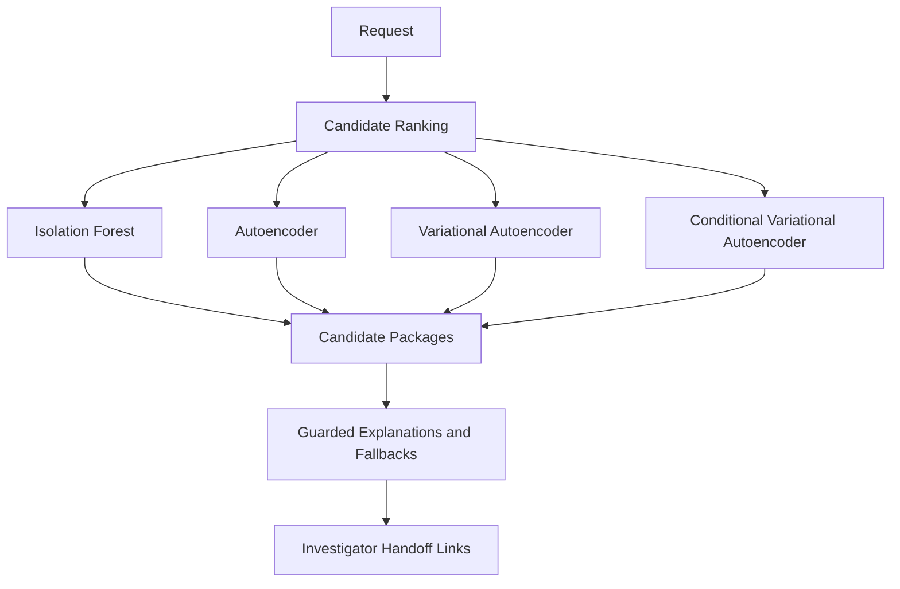
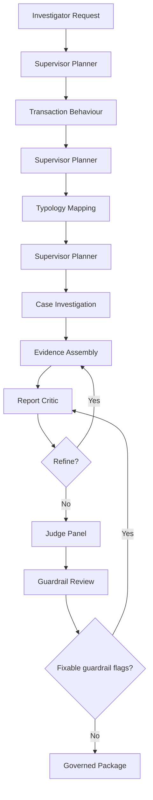

# Agents and Workflows

This document describes the current agent catalog and active workflow design. The frontend exposes two primary role workflows: Data Scientist candidate generation and Investigator case review.

## Primary Role Contracts

### Data Scientist

Purpose: generate model-prioritized AML investigation candidates from the modeled customer population.

Primary task:

```text
generate_model_driven_candidates
```

Route:

```text
candidate_ranking_agent
-> guardrail_agent
```

The API response for this task is model-output oriented. It returns `model_run_summary`, `model_results`, `model_comparison`, and `candidate_packages`. It intentionally does not run or display report-quality judge cards, because judge faithfulness/citation/compliance scores are not model performance metrics.

### Investigator

Purpose: review one model-prioritized customer, gather evidence, map typology indicators carefully, produce a disposition recommendation, and return model-feedback fields.

Primary task:

```text
investigate_model_prioritized_candidate
```

Route:

```text
supervisor_planner_agent
-> transaction_behaviour_agent
-> typology_mapping_agent
-> case_investigation_agent
-> evidence_assembly_agent
-> report_critic_agent
-> judge_panel_agent
-> guardrail_agent
```

The primary Investigator route uses `InvestigatorAgenticRunner`, not a plain fixed graph. The runner streams planner decisions and agent events, enforces bounded evidence actions in order, allows one critic refinement, and allows one guardrail remediation pass before returning the final governed package.

## Agent Catalog

### Candidate Ranking Agent

Purpose: generate ranked model-driven candidates for investigator handoff.

Inputs:
- Local model service artifacts under `artifacts/models/`.
- Feature matrix from `artifacts/models/customer_features.csv`.
- Real-data transaction slices from `real_data/` when packaging a specific customer.
- Optional LLM client for readable candidate explanation wording.

Outputs:
- `model_run_summary`.
- Four model result lists:
  - `isolation_forest`
  - `autoencoder`
  - `variational_autoencoder`
  - `conditional_variational_autoencoder`
  - `intersection`
- Detection Candidate Packages with model score, rank, threshold, feature drivers, guarded explanation, limitations, missing data, suggested investigation focus, and required disclaimer.

Guardrail behaviour:
- LLM explanations can only summarize deterministic model evidence.
- Unsafe candidate explanation wording is replaced with deterministic fallback wording.

### Supervisor Planner Agent

Purpose: choose the next bounded Investigator evidence action.

Allowed actions:
- `transaction_behaviour_agent`
- `typology_mapping_agent`
- `case_investigation_agent`
- `finalize_report`

Runtime policy:
- The bounded Investigator runner overrides invalid or out-of-order planner choices.
- Required evidence actions run before final report assembly.

### Transaction Behaviour Agent

Purpose: explain customer activity patterns using real transaction history, engineered feature summaries, and channel/network summaries.

Inputs:
- Transactions from `DataService.get_transactions`.
- Feature summary from `DataService.get_feature_summary`.
- Network summary from `DataService.get_network_summary`.

Outputs:
- Behavioural summary.
- Abnormal patterns.
- Evidence items.
- Uncertainty and confidence.

### Typology Mapping Agent

Purpose: map observed activity to AML typology indicators using retrieved official-source context and careful language.

Inputs:
- User query.
- Prior transaction behaviour output, when available.
- Retrieved RAG documents from `KnowledgeRetriever`.

Runtime retrieval:
- Default runtime retrieval uses PostgreSQL/pgvector.
- For the primary Investigator handoff route only, the node uses a local keyword fallback when pgvector is unavailable so local case review remains possible.
- Other typology routes fail loudly when pgvector is unavailable.

Outputs:
- Matched typologies.
- Supporting indicators.
- Citation objects.
- Missing evidence.
- Careful, non-conclusive summary.

### Case Investigation Agent

Purpose: prepare investigator case review and feedback for model monitoring.

Inputs:
- Customer ID.
- Query.
- Prior behaviour and typology outputs.
- Candidate package generated for the customer through `CandidateGenerationService`.

Outputs:
- Candidate package.
- Behaviour review.
- Typology review.
- Missing evidence.
- Disposition recommendation.
- Investigator feedback fields for model evaluation.

### Evidence Assembly Agent

Purpose: compose a role-aware AML intelligence report from only the agents that actually ran.

Inputs:
- Role.
- Task type.
- Executed agents.
- Agent outputs.
- Critic reviews and refinement context.

Outputs:
- Markdown report.
- Included sections.
- Evidence table.
- Limitations and uncertainty.
- Recommended analytical next steps.

### Report Critic Agent

Purpose: review the draft Investigator report before final governance.

Outputs:
- Critic status.
- Issues.
- Optional target section.
- Optional refinement instruction.
- `must_refine` decision.
- Confidence.

The bounded Investigator runner allows one evidence-assembly refinement pass from critic feedback.

### Judge Panel Agent

Purpose: score generated output for quality and governance readiness.

Judges:
- Faithfulness.
- Citation support.
- Compliance.
- Typology wording.
- Data science quality.
- Usefulness.

Important distinction:
- Data Scientist candidate generation does not run `judge_panel_agent`.
- Investigator report generation runs `judge_panel_agent`, and `PolicyEngine.evaluate_output` also runs final response gating.

### Guardrail Agent

Purpose: perform final compliance-oriented review and prevent unsafe output delivery.

Checks:
- Empty or malformed query state.
- Missing agent outputs.
- Prohibited AML certainty language.
- Unsupported typology claims.
- Model-score-as-proof language.
- Required disclaimers.

The bounded Investigator runner allows one remediation pass for fixable guardrail flags. Non-remediable flags such as empty query or missing agent outputs do not loop.

### Legacy/Generic Agents

These agents remain available for generic routes and tests but are not primary frontend workflows:

- `model_explanation_agent`
- `feature_critic_agent`
- `evidence_assembly_agent`
- `judge_panel_agent`
- `guardrail_agent`

`model_validator` and `compliance_strategy` are no longer supported roles in `SupportedRole`.

## Role Permissions

| Role | Allowed agents |
| --- | --- |
| Data Scientist | `transaction_behaviour_agent`, `model_explanation_agent`, `feature_critic_agent`, `candidate_ranking_agent`, `evidence_assembly_agent`, `judge_panel_agent`, `guardrail_agent` |
| Investigator | `transaction_behaviour_agent`, `typology_mapping_agent`, `case_investigation_agent`, `supervisor_planner_agent`, `evidence_assembly_agent`, `report_critic_agent`, `judge_panel_agent`, `guardrail_agent` |

## Workflow Patterns

### Data Scientist Candidate Generation



### Investigator Case Review



## Partial-Agent Execution

Manual `selected_agents` are allowed when the role has permission for every selected agent. The router appends `guardrail_agent` as the final step for selected partial routes. It does not automatically add evidence assembly or judge panel for manual partial routes.

Exceptions:
- `generate_model_driven_candidates` runs `candidate_ranking_agent` and the appended `guardrail_agent`, but candidate explanation safety is also enforced inside candidate packaging before results are returned.
- `supervisor_planner_agent` and `report_critic_agent` are reserved for the primary Investigator route and are rejected in manual partial selections.
