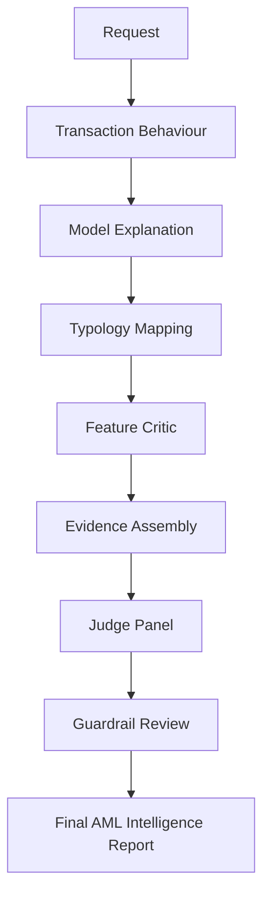
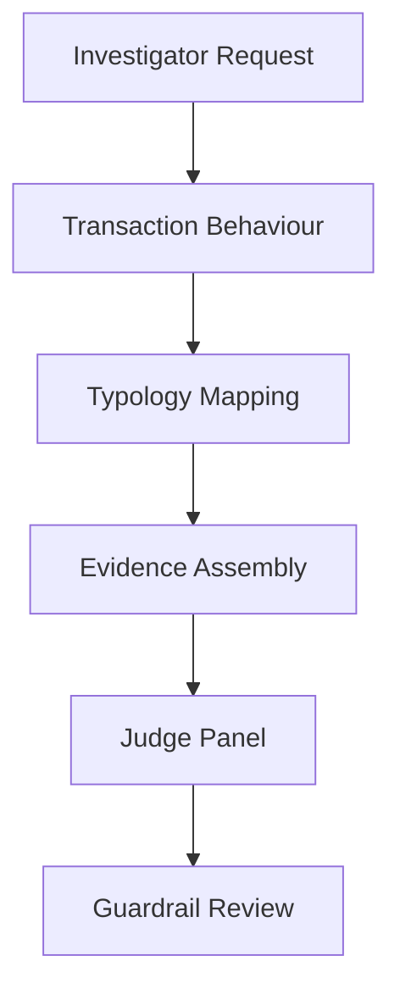
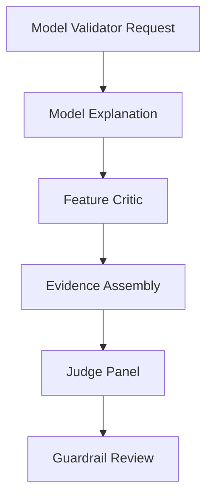

# Agents and Workflows

## Agent Catalog

### Transaction Behaviour Agent

Purpose: explain customer activity patterns using transaction history, feature summaries, and counterparty/network summaries.

Inputs:
- Customer transactions from `DataService.get_transactions`.
- Customer feature summary from sample data or trained real-data feature artifacts.
- Network summary from sample data or real channel transactions.

Outputs:
- Behavioural summary.
- Abnormal patterns.
- Evidence items.
- Confidence score.

Use cases:
- Investigator review of customer activity.
- Data scientist review of feature behaviour.
- Evidence context before typology mapping.

### Model Explanation Agent

Purpose: explain model-driven AML risk signals without treating model output as proof.

Current implementation:
- Uses `ModelService.score_customer` when trained artifacts are available.
- Uses an explicit `untrained` / `model_artifact_required` envelope when no model artifact or no customer feature row is available.
- Does not rely on `model_outputs.csv` for agent execution.

Outputs:
- Model summary.
- Top risk drivers.
- Score interpretation.
- Model uncertainty.
- Feature directionality.
- Caveats.

Use cases:
- Model validator review.
- Data scientist review.
- Investigator-facing explanation of why a model prioritized a customer.

### Typology Mapping Agent

Purpose: map observed activity to AML typology indicators using retrieved official-source knowledge and careful language.

Inputs:
- User query.
- Prior transaction behaviour output, when available.
- Retrieved RAG documents from `KnowledgeRetriever`.

Outputs:
- Matched typologies.
- Supporting indicators.
- Citations.
- Missing evidence.
- Confidence.
- Careful, non-conclusive summary.

Use cases:
- Investigator typology context.
- Compliance strategy review.
- Guardrail-safe narrative grounding.

### Feature Critic Agent

Purpose: critique AML feature quality and recommend validation-ready feature improvements.

Inputs:
- Customer feature summary.
- Model score output from `ModelService` when available.
- Prior behaviour analysis, when available.

Outputs:
- Feature quality findings.
- Unstable features.
- Leakage risks.
- Missing feature opportunities.
- PySpark-style feature recommendations.
- Validation tests.

Use cases:
- Data science feature backlog.
- Model validation evidence.
- Feature governance discussions.

### Evidence Assembly Agent

Purpose: compose a role-aware AML intelligence report from only the agents that actually ran.

Inputs:
- Role.
- Task type.
- Executed agents.
- Agent outputs.

Outputs:
- Markdown report.
- Included sections.
- Evidence table.
- Limitations and uncertainty.
- Recommended analytical next steps.

Use cases:
- Final report packaging.
- Partial-agent workflows.
- Role-specific summaries.

### Judge Panel Agent

Purpose: score the generated output for quality and governance readiness.

Judges:
- Faithfulness.
- Citation support.
- Compliance.
- Typology wording.
- Data science quality.
- Usefulness.

Use cases:
- Quality gate before report presentation.
- Auditability of generated intelligence.
- Regression testing of agent behaviour.

### Guardrail Agent

Purpose: perform final compliance-oriented review and prevent unsafe output delivery.

Checks:
- Empty or malformed query state.
- Missing agent outputs.
- Prohibited AML certainty language.
- Required disclaimers.

Use cases:
- Final route step for every route.
- Safe fallback report generation when evidence assembly did not run.

## Role Permissions

| Role | Main Agents |
| --- | --- |
| Data scientist | Transaction behaviour, model explanation, feature critic, evidence assembly, judge panel, guardrail |
| Investigator | Transaction behaviour, typology mapping, evidence assembly, judge panel, guardrail |
| Model validator | Model explanation, feature critic, evidence assembly, judge panel, guardrail |
| Compliance strategy | Typology mapping, evidence assembly, judge panel, guardrail |

## Workflow Patterns

### Full Intelligence Report

### Investigator Summary

### Model Validation Review

## Partial-Agent Execution

Manual `selected_agents` are allowed when the role has permission for every selected agent. The router always appends `guardrail_agent` as the final step. It does not automatically add evidence assembly or judge panel for manual partial routes; callers must select those agents if they want a full report and judge review.

This design reduces latency and data exposure, but it means partial workflows can produce fallback reports when evidence assembly is skipped.
