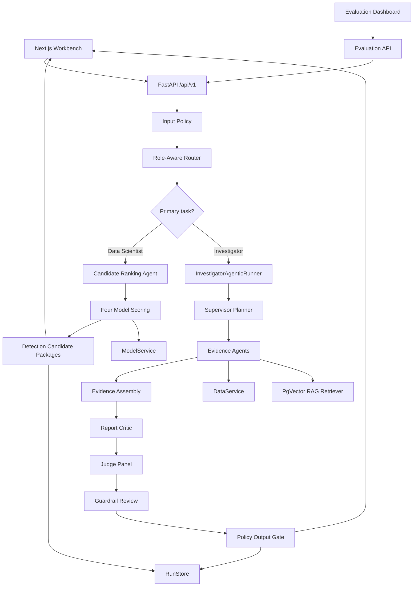

# AML Agentic Intelligence Workbench - Architecture

## Scope and Accuracy Notes

This document describes the current repository implementation. It separates active runtime behaviour from foundations that exist in code but are not fully wired into the request path.

The active local runtime is:

- Backend: FastAPI, Pydantic, LangGraph-compatible dynamic graph execution, bounded Investigator orchestration, pandas-backed real-data access, local anomaly model scoring, pgvector RAG retrieval, mock-or-OpenAI-compatible LLM client, deterministic guardrails, judge evaluation, and golden-dataset system evaluation.
- Frontend: Next.js App Router, React Query, Tailwind CSS, typed fetch wrappers, two primary role workspaces, streaming Investigator execution timeline, customer-data browser, report history, and evaluation dashboard.
- Infrastructure: Docker Compose for API, PostgreSQL with pgvector image, and Redis.

## High-Level Architecture



## Repository Layout

```text
aml_agentic_workbench/
  backend/
    app/
      agents/        Router, graph, nodes, bounded Investigator runner
      api/routes/    FastAPI route handlers
      core/          Configuration, constants, logging, security placeholder
      evaluation/    Judge panel, golden dataset, runner
      guardrails/    Input, output, tool, PII, approval, and policy engine
      llm/           Provider-neutral LLM client, mock client, prompts, schemas
      ml/            Real-data features, local models, SHAP explanations
      rag/           File-backed and pgvector ingestion/retrieval utilities
      schemas/       API and domain schemas
      services/      Data, candidate generation, retrieval, audit, run store
      storage/       SQLAlchemy ORM models and repository wrappers
      tests/         Backend test suite
      tools/         MCP-style internal tool interfaces and registry
  frontend/
    app/             Next.js pages
    components/      Shell, role workspace, report view, execution timeline
    lib/             API wrapper, route catalog, utilities
    types/           TypeScript API types
artifacts/
  models/            Trained model artifacts and customer feature matrix
  rag/               File-backed RAG artifacts for tests/offline experiments
real_data/           Transaction, KYC, lookup, and label CSV inputs
docs/
docker-compose.yml
```

## Backend Application

The backend application is created in `aml_agentic_workbench/backend/app/main.py`.

Route groups mounted under `/api/v1`:

- `GET /health`: liveness response with service name, version, and timestamp.
- `GET /roles`: supported role catalog.
- `POST /analysis`: role-aware analysis execution.
- `POST /analysis/stream`: streaming primary Investigator execution over server-sent events.
- `GET /reports`: local run history list.
- `GET /reports/{run_id}`: local run detail.
- `GET /reports/{report_id}/status`: status lookup backed by local run store.
- `GET /customer-data/sources`: local customer-data source metadata.
- `GET /customer-data/customer/{customer_id}`: customer-scoped data browser response.
- `POST /evaluations/generate-golden-dataset`: generate evaluation cases in memory.
- `POST /evaluations/run`: run system evaluation.
- `GET /evaluations`: list evaluation runs.
- `GET /evaluations/{run_id}`: evaluation run detail.

Configuration is environment-driven through `pydantic-settings` in `app/core/config.py`.

## Roles and Routes

Supported roles are defined in `app/schemas/roles.py`:

- `data_scientist`
- `investigator`

Supported task types are defined in `app/core/constants.py`:

- `generate_model_driven_candidates`
- `investigate_model_prioritized_candidate`
- `customer_behaviour_analysis`
- `model_risk_explanation`
- `typology_mapping`
- `feature_quality_review`
- `full_intelligence_report`
- `investigator_summary`

The frontend exposes only the two primary workflows:

| Role | Primary task | Runtime design |
| --- | --- | --- |
| Data Scientist | `generate_model_driven_candidates` | four-model candidate generation and guarded handoff packages |
| Investigator | `investigate_model_prioritized_candidate` | bounded planner, evidence agents, report critic, judge panel, guardrail review |

`model_validator` and `compliance_strategy` are no longer valid roles.

## Analysis Endpoint Flow

`POST /api/v1/analysis` is implemented in `app/api/routes/analysis.py`.

Common steps:

1. Validate `AnalysisRequest`.
2. Run input policy through `PolicyEngine.evaluate_input`.
3. Reject Investigator requests without a valid `customer_id` found in local customer data.
4. Resolve the authorized route with `RoleAwareRouter`.
5. Create `AMLAgentState`.
6. Execute either the primary Investigator runner or the dynamic graph.
7. Build `AnalysisResponse`.
8. Store report detail in the in-memory `RunStore`.

Data Scientist candidate generation has a specialized response path:

- Runs candidate generation.
- Runs the appended `guardrail_agent` route step.
- Returns model-output fields.
- Does not run `judge_panel_agent`.
- Returns `judge_scores=None`.
- Uses candidate-level guardrails for each LLM explanation.

Investigator and generic report paths:

- Run graph or bounded Investigator orchestration.
- Evaluate final output through `PolicyEngine.evaluate_output`.
- Distinguish judge-only warnings from actual guardrail failures.
- Store unsafe output for audit-only metadata when blocked or rewritten.
- Return final report, governance status, judge status, failure reasons, executed agents, and audit trace.

## Data Scientist Candidate Generation

The primary Data Scientist workflow uses `candidate_ranking_agent` and `CandidateGenerationService`.

The service calls `ModelService.score_all_models(top_k=10)` and returns:

- `model_run_summary`
- `model_comparison`
- `model_results`
- `candidate_packages`
- `model_limitations`

Model result keys:

- `isolation_forest`
- `autoencoder`
- `variational_autoencoder`
- `conditional_variational_autoencoder`
- `intersection`

Detection Candidate Packages include:

- Candidate/customer/model/run IDs.
- Rank, normalized score, score percentile, threshold, and recommendation.
- Feature drivers and model-specific driver details.
- Guarded LLM explanation or deterministic fallback explanation.
- Supporting transaction slices when building a single-customer package.
- Model limitations, missing data, suggested investigation focus, and required disclaimer.

Candidate explanation guardrails are intentionally narrower than report guardrails: they allow safe model-prioritization wording and block conclusive AML, typology, or STR language.

## Model Layer

The model layer lives under `app/ml`.

### Offline Artifacts

`python -m app.ml.train_model --data-dir real_data --artifact-dir ../../artifacts/models` builds:

- `aml_isolation_forest.joblib`
- `feature_scaler.joblib`
- `feature_schema.json`
- `training_metrics.json`
- `customer_features.csv`

The `.joblib` filenames are retained for continuity, but the Isolation Forest and scaler artifacts are JSON payloads.

### Scoring Families

`IsolationForestModelService` loads the offline artifacts and scores:

- Isolation Forest through the local random isolation tree implementation.
- Autoencoder through a small PyTorch reconstruction model.
- Variational Autoencoder through deterministic latent-mean reconstruction plus KL term.
- Conditional Variational Autoencoder through a PyTorch conditional VAE with KYC customer-type conditions.

Deep-model artifacts are saved as `*_torch.pt` files in the model artifact directory and are trained deterministically on first use when missing.

Explanation methods:

- Isolation Forest: model-agnostic SHAP over the normalized anomaly-score function.
- Autoencoder: per-feature reconstruction-error contribution.
- VAE/CVAE: per-feature reconstruction-error contribution; the KL term contributes to score but is not feature-attributed in the display.

The system treats all model outputs as prioritization signals, not proof of suspicious activity.

## Investigator Agentic Runner

`InvestigatorAgenticRunner` implements the primary Investigator workflow in `app/agents/investigator_orchestrator.py`.

The runner:

- Streams events for live UI progress.
- Runs `supervisor_planner_agent` before each evidence action.
- Enforces the evidence order:
  - `transaction_behaviour_agent`
  - `typology_mapping_agent`
  - `case_investigation_agent`
  - `finalize_report`
- Runs `evidence_assembly_agent`.
- Runs `report_critic_agent`.
- Allows one evidence-assembly refinement if the critic requires it.
- Runs `judge_panel_agent` and `guardrail_agent`.
- Allows one remediation pass for fixable guardrail flags.

Non-remediable guardrail flags such as empty query or missing agent outputs do not loop.

## Dynamic Graph Layer

Generic and partial routes use `DynamicGraphBuilder` in `app/agents/graph.py`.

If `langgraph` is importable, it builds a `StateGraph[AMLAgentState]` containing only the selected route agents and links them sequentially. If LangGraph is unavailable, it uses a local sequential fallback runner with the same node order.

Partial-agent execution is explicit through `selected_agents`. The router validates role permissions and appends `guardrail_agent` for selected routes. It does not automatically add evidence assembly or judge panel.

## Shared State

`AMLAgentState` is defined in `app/agents/state.py`. It carries:

- Request identity: role, task type, query, run ID, customer ID, alert ID.
- Routing: route, route explanation, executed agents.
- Evidence: transaction summary, model outputs/results, retrieved documents, candidate packages.
- Investigator orchestration: planner decisions, critic reviews, stop reason, refinement/remediation counters.
- Outputs: agent outputs, judge outputs, guardrail flags, final report.
- Audit: audit trace and stream events.

Each agent records a structured output and appends an `agent_completed` event unless it is a planner-only decision node.

## Data Layer

`DataService` is a pandas-backed local data facade.

Runtime data sources:

- Transaction CSVs under `real_data/`: `abm`, `card`, `cheque`, `eft`, `emt`, `westernunion`, `wire`.
- KYC CSVs under `real_data/`: individual, small business, occupation lookup, industry lookup.
- Model feature matrix under `artifacts/models/customer_features.csv`.

Data service capabilities:

- `get_transactions(customer_id, limit=None)`
- `get_feature_summary(customer_id)`
- `get_model_outputs(customer_id)`
- `get_network_summary(customer_id)`
- `customer_exists(customer_id)`
- `list_customer_data_sources()`
- `get_customer_data_profile(customer_id, source="all", limit=100)`

There is no active synthetic-data fallback in the current `DataService`; missing real-data/model-feature rows fail explicitly or return empty evidence depending on caller safety requirements.

## RAG Retrieval Layer

The runtime retriever is `PgVectorKnowledgeRetriever`.

Runtime storage:

- PostgreSQL table `rag_source_documents`.
- PostgreSQL table `rag_chunks` with `vector(384)` embeddings.
- Ingestion metadata tables `rag_ingestion_runs` and `rag_ingestion_failures`.

Embedding backend:

- Local deterministic hashing of unigrams and bigrams into normalized vectors.

Ingestion command:

```bash
python -m app.rag.ingest_pgvector --manifest config/rag_sources.yaml
```

Default behaviour:

- Generic typology/RAG routes fail loudly when pgvector is unavailable.
- The primary Investigator handoff route catches `RagStoreUnavailable` and uses `LocalKeywordRetriever` with a limitation note so local review can continue.

`SemanticKnowledgeRetriever` and `LocalKeywordRetriever` remain for tests, offline artifact experiments, and the narrow Investigator local fallback.

## LLM Layer

The LLM abstraction is defined in `app/llm/client.py`.

Implementations:

- `MockLLMClient`: deterministic and schema-aware, used when `OPENAI_API_KEY` is unset.
- `OpenAICompatibleClient`: calls an OpenAI-compatible `/chat/completions` endpoint and validates JSON against the requested Pydantic schema.

Agent prompts live in `app/llm/prompts.py`; structured output schemas live in `app/llm/schemas.py`.

The OpenAI-compatible path can fail if the configured model returns malformed or schema-invalid JSON. The mock path is deterministic and suitable for local tests.

## Guardrails and Policy

Guardrails live under `app/guardrails`.

Input guardrails check:

- Prompt injection/extraction patterns.
- Unsafe laundering-evasion requests.
- Placeholder unauthorized customer access logic.

Output guardrails check:

- Prohibited AML certainty language.
- STR instruction language.
- Typology claims without citations.
- Citation markers without citation objects.
- Model-score-as-proof language.
- PII patterns.
- Candidate-explanation-specific unsafe wording.

`PolicyEngine` coordinates input guardrails, output guardrails, judge panel evaluation, and approval gate logic.

`ApprovalGate` exists as a policy abstraction for sensitive actions such as report export, external send, STR-like narrative generation, case escalation, and external writes. No full approval workflow API/UI is wired yet.

## Evaluation Layer

The evaluation layer lives under `app/evaluation`.

The judge panel runs:

- `FaithfulnessJudge`
- `CitationJudge`
- `ComplianceJudge`
- `TypologyJudge`
- `DataScienceJudge`
- `UsefulnessJudge`

Weighted aggregation:

```text
faithfulness: 0.25
citation: 0.20
compliance: 0.20
typology: 0.15
data_science: 0.10
usefulness: 0.10
```

System evaluation:

- Generates golden cases covering primary tasks, routes, RAG/citation expectations, guardrails, missing customers, and model cases.
- Executes cases through the same analysis orchestration path used by `POST /api/v1/analysis`.
- Stores generated cases and run summaries in memory through `EvaluationStore`.
- Displays metrics and case failures in the frontend `/evaluations` page.

## Storage Layer

Active runtime storage:

- `RunStore`: in-memory, thread-safe report history.
- `EvaluationStore`: in-memory generated cases and evaluation run summaries.

ORM foundation:

- `AgentRun`
- `AgentStep`
- `Report`
- `AuditLog`
- `JudgeResult`

Repository wrappers and database session management exist, but the analysis request path logs ORM-like run/step objects rather than committing durable PostgreSQL report records.

## Tool Access Layer

The tool layer under `app/tools` is MCP-style in shape but is not a networked MCP server.

It provides:

- Named tool descriptors.
- Pydantic input/output schemas.
- Role-scoped access.
- Registry-owned execution context.
- Timeout handling.
- Tool guardrails.
- Structured audit metadata.

Registered tools include:

- `get_customer_transactions`
- `get_customer_feature_summary`
- `get_model_outputs`
- `search_aml_knowledge_base`
- `get_counterparty_network_summary`
- `save_report`

Current architecture note: active agent nodes directly use `DataService`, `KnowledgeRetriever`, and `ModelService`. The tool registry is implemented and tested as a governed internal access layer but is not the execution path for these nodes yet.

## Frontend Architecture

Main pages:

- `/`: landing page for the current two-role workbench.
- `/roles`: role catalog.
- `/roles/[role]`: role-specific workspace.
- `/history`: previous local runs from `RunStore`.
- `/reports/[runId]`: report detail.
- `/customer-data`: local customer evidence browser.
- `/evaluations`: golden-dataset evaluation dashboard.

Important components:

- `Shell`: navigation and page shell.
- `RoleWorkspace`: Data Scientist and Investigator request workspace.
- `AgentProgressTimeline`: estimated progress for non-streaming runs and live SSE event display for Investigator streaming.
- `ReportView`: four-model Data Scientist result view or governed Investigator report view.
- `ui.tsx`: local UI primitives.

The frontend route preview comes from `frontend/lib/catalog.ts` and is for user orientation. The backend route response remains authoritative.

## Known Gaps and Risks

- Report history and evaluation runs are not durable across API restarts.
- PostgreSQL is required for runtime RAG retrieval after ingestion, but analysis/report persistence is not yet PostgreSQL-backed.
- Redis infrastructure exists but is not used by active analysis, routing, retrieval, report, or evaluation paths.
- Deep model artifacts are local prototype artifacts trained on first use if missing; production should replace this with governed training and artifact promotion.
- RAG embeddings are deterministic local hashing vectors, not production-grade semantic embeddings.
- The primary Investigator route has a local keyword fallback when pgvector is unavailable; other typology routes fail loudly.
- Production authentication, authorization, row-level customer access control, secrets management, migrations, and external system integrations are not implemented.
- The frontend export button is UI-only; no export endpoint or approval workflow is active.
- Real-data artifacts are local files, not governed feature stores, model registries, or data-platform integrations.

## Verification Coverage

Backend tests cover:

- Role contracts and deprecated role rejection.
- Candidate packages and Investigator feedback.
- Four-model candidate results and intersections.
- SHAP Isolation Forest explanations and feature dictionary coverage.
- Investigator planner/critic/governance streaming orchestration.
- Routing and dynamic graph execution.
- Data service and customer-data API.
- Tool registry permissions and guardrails.
- RAG pgvector utilities and fallback behaviour.
- Evaluation API and golden-dataset runner.
- Health, schemas, and configuration.

Frontend verification is currently through TypeScript type checking and production build:

```bash
cd aml_agentic_workbench/frontend
pnpm typecheck
pnpm build
```
