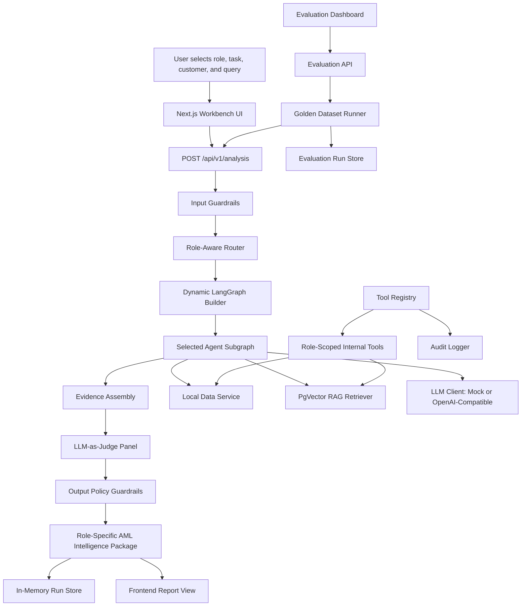
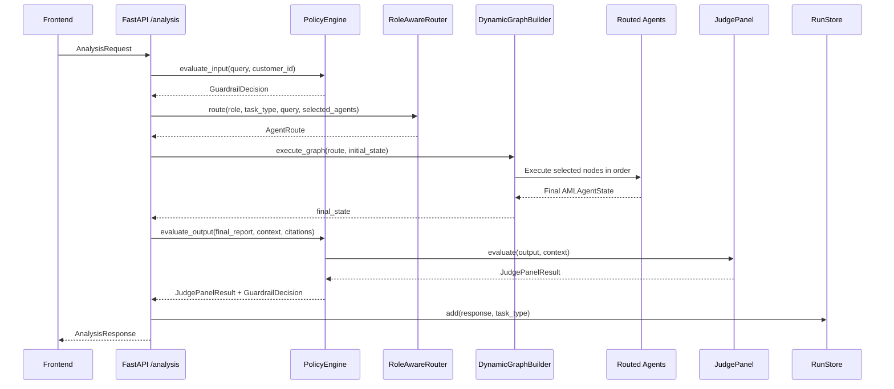
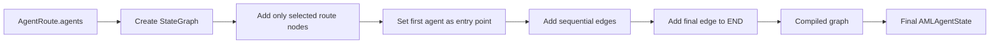
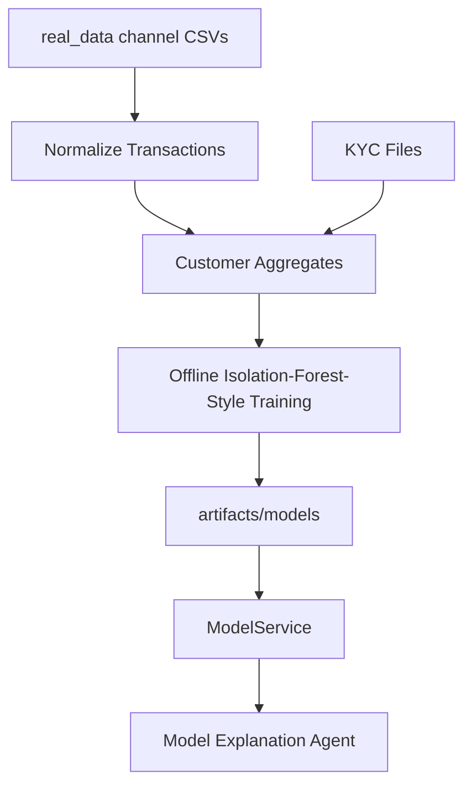
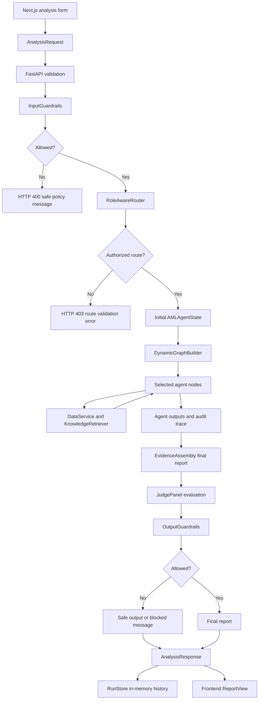

# AML Agentic Intelligence Workbench - Architecture

## Scope and Accuracy Notes

This document describes the current repository implementation. It intentionally separates active runtime behaviour from foundations that exist in code but are not yet fully wired into the request path.

The active local runtime is:

- Backend: FastAPI, Pydantic, LangGraph-compatible dynamic execution, pandas-backed synthetic and real-data access, offline real-data anomaly scoring, PostgreSQL/pgvector RAG retrieval, mock-or-OpenAI-compatible LLM client, deterministic guardrails, judge evaluation, and golden-dataset system evaluation.
- Frontend: Next.js App Router, React Query, Tailwind CSS, and typed fetch wrappers.
- Infrastructure: Docker Compose for API, PostgreSQL with pgvector image, and Redis.

## High-Level Architecture



## Repository Layout

```text
aml_agentic_workbench/
  backend/
    app/
      agents/        Dynamic routing, state, graph assembly, agent nodes
      api/routes/    FastAPI route handlers
      core/          Configuration, logging, constants, security placeholder
      evaluation/    Judge panel and individual judges
      guardrails/    Input, output, tool, PII, approval, and policy engine
      llm/           Provider-neutral LLM client, mock client, prompts, schemas
      schemas/       API and domain schemas
      services/      Data, retrieval, audit, database, Redis, telemetry, run store
      storage/       SQLAlchemy ORM models and repository wrappers
      tests/         Backend test suite
      tools/         MCP-style internal tool interfaces and registry
  frontend/
    app/             Next.js pages
    components/      Shell, report view, route preview, UI primitives
    lib/             API wrapper, route catalog, utilities
    types/           TypeScript API types
artifacts/
  models/            Trained model artifacts and customer feature matrix
  rag/               Official-source local RAG artifacts
real_data/           Customer transaction, KYC, and label CSV inputs
docker-compose.yml
README.md
docs/
```

## Backend Architecture

### FastAPI Application

The backend application is created in `aml_agentic_workbench/backend/app/main.py`.

It mounts these API route groups under `/api/v1`:

- `GET /health`: liveness response with service name, version, and timestamp.
- `GET /roles`: supported workbench roles.
- `POST /analysis`: main multi-agent analysis execution endpoint.
- `GET /reports`: local run history list.
- `GET /reports/{run_id}`: local run detail.
- `GET /reports/{report_id}/status`: status lookup backed by local run store.

Configuration is environment-driven through `pydantic-settings` in `app/core/config.py`. The main configurable values include database URL, Redis URL, tracing provider, OpenAI-compatible endpoint settings, mock LLM model name, temperature, and timeout.

### Analysis Endpoint Flow

The core orchestration lives in `app/api/routes/analysis.py`.



The endpoint performs these steps:

1. Validate the request using `AnalysisRequest`.
2. Run input guardrails through `PolicyEngine.evaluate_input`.
3. Resolve a route with `RoleAwareRouter`.
4. Create an `AMLAgentState` with role, task, query, customer ID, alert ID, route, and route explanation.
5. Execute the dynamic graph with only the routed agents.
6. Collect final report and citations from agent outputs.
7. Run the policy engine output evaluation, which combines the judge panel and output guardrails.
8. If output policy fails, store the unsafe output in audit-only metadata and return a safe message or rewrite.
9. Create in-memory ORM-like run and step records through `AgentRunLogger` for structured logging.
10. Store the response in the in-memory `RunStore`.
11. Return `AnalysisResponse` with run ID, executed agents, status, result payload, guardrail status, judge scores, and route explanation.

## LangGraph Orchestration Flow

The orchestration layer is in `app/agents/graph.py`.

`DynamicGraphBuilder` receives an `AgentRoute` and builds a graph containing exactly the route's agents. If `langgraph` is importable, it constructs a `StateGraph[AMLAgentState]`, sets the first route agent as the entry point, links each route step sequentially, and compiles the graph. If LangGraph is unavailable, it uses a local sequential fallback runner with the same node order.



### Shared State

`AMLAgentState` is a `TypedDict` defined in `app/agents/state.py`. It carries:

- Request identity and context: `role`, `task_type`, `query`, `run_id`, `customer_id`, `alert_id`.
- Routing metadata: `route`, `route_explanation`, `executed_agents`.
- Evidence and working data: `transaction_summary`, `model_outputs`, `retrieved_documents`.
- Outputs: `agent_outputs`, `judge_outputs`, `guardrail_flags`, `final_report`.
- Audit: `audit_trace`.

Each agent mutates the state by adding its own structured output, appending to `executed_agents`, and adding an `agent_completed` event to `audit_trace`.

## Router Design

Routing is implemented in `app/agents/router.py`.

The router supports four roles:

- `data_scientist`
- `investigator`
- `model_validator`
- `compliance_strategy`

The router supports these task types:

- `customer_behaviour_analysis`
- `model_risk_explanation`
- `typology_mapping`
- `feature_quality_review`
- `full_intelligence_report`
- `investigator_summary`
- `model_validation_review`
- `compliance_typology_review`

The router uses three layers:

1. Role-agent permissions:
   Each role has an allowed set of agents. Unauthorized selected agents raise `RouteValidationError`.

2. Role/task route table:
   Specific role and task combinations map to prescribed routes.

3. Task fallback routes:
   Generic tasks map to minimal routes when no role-specific route exists.

The final route must end with `guardrail_agent`. The router appends it automatically for automatic and selected partial routes.

### Route Examples

For `data_scientist` and `model_risk_explanation`, the route is:

```text
transaction_behaviour_agent
-> model_explanation_agent
-> feature_critic_agent
-> evidence_assembly_agent
-> judge_panel_agent
-> guardrail_agent
```

For `investigator` and `investigator_summary`, the route is:

```text
transaction_behaviour_agent
-> typology_mapping_agent
-> evidence_assembly_agent
-> judge_panel_agent
-> guardrail_agent
```

For `full_intelligence_report`, the route includes all primary agents plus evidence assembly, judge panel, and final guardrail review.

## Partial-Agent Execution Design

Partial-agent execution is explicit. A caller can pass `selected_agents` in `AnalysisRequest`. The router normalizes the selection, removes duplicates, appends the mandatory `guardrail_agent`, and validates the final route against role permissions.

This design has three purposes:

- Reduce latency and LLM/tool cost.
- Limit data exposure to only the agents needed for a task.
- Make execution auditable by recording the exact route and executed agents.

Important detail: the router does not automatically add `evidence_assembly_agent` or `judge_panel_agent` to a manual partial selection. It only appends `guardrail_agent`. If a caller selects only `transaction_behaviour_agent`, the route will run transaction behaviour and guardrail review; final report generation will rely on guardrail fallback report logic unless evidence assembly is included.

## Agent Nodes

Agent nodes are defined in `app/agents/nodes.py`.

### Transaction Behaviour Agent

Inputs:

- Customer transactions from `DataService.get_transactions`.
- Feature summary from `DataService.get_feature_summary`.
- Network summary from `DataService.get_network_summary`.

Output schema:

- `TransactionBehaviourOutput`

Purpose:

- Explain velocity changes, new counterparty ratio, cross-border amount ratio, active-hours entropy, in/out amount ratio, concentration, amount spikes, and round amount patterns.

### Model Explanation Agent

Inputs:

- Model outputs from `DataService.get_model_outputs`.
- Feature summary from `DataService.get_feature_summary`.

Output schema:

- `ModelExplanationOutput`

Purpose:

- Explain top model risk drivers and uncertainty.
- Enforce that model scores are not treated as proof of suspicious activity.

### Typology Mapping Agent

Inputs:

- Retrieved documents from `KnowledgeRetriever.search`.
- Prior transaction behaviour output, when present.

Output schema:

- `TypologyMappingOutput`

Purpose:

- Map behaviour to AML typology indicators with citations and careful language.
- Avoid legal conclusions or STR filing instructions.

### Feature Critic Agent

Inputs:

- Feature summary.
- Model outputs.
- Prior behaviour analysis, when present.

Output schema:

- `FeatureCriticOutput`

Purpose:

- Review feature quality.
- Identify unstable features and possible leakage risks.
- Recommend PySpark-style feature opportunities and validation tests.

### Evidence Assembly Agent

Inputs:

- Prior agent outputs.
- Role, task type, and executed agents.

Output schema:

- `EvidenceAssemblyOutput`

Purpose:

- Compose a Markdown report with only the sections supported by agents that actually ran.
- Include evidence table, limitations, uncertainty, and recommended analytical next steps.

### Judge Panel Agent

Inputs:

- Final report if present, otherwise serialized agent outputs.
- Evaluation context built from transactions, model outputs, retrieved documents, citations, and agent outputs.

Purpose:

- Run judge evaluation inside the graph and record judge outputs as an agent result.

### Guardrail Agent

Inputs:

- Final report.
- Agent outputs.
- Judge outputs.

Output schema:

- `GuardrailReviewOutput`

Purpose:

- Perform final agent-level compliance review.
- Add flags for empty query or missing agent outputs.
- Create a fallback report if evidence assembly did not produce one.

## Tool Access Layer

Tools are implemented under `app/tools`.

The key classes are:

- `BaseTool`: abstract typed tool contract.
- `ToolRegistry`: allowlisted registry and executor.
- `ToolContext`: role, actor, and request context supplied by the registry.
- `ToolOutput`: standard result envelope.

Registered tools include:

- `get_customer_transactions`
- `get_customer_feature_summary`
- `get_model_outputs`
- `search_aml_knowledge_base`
- `get_counterparty_network_summary`
- `save_report`

The registry:

- Registers tools by unique name.
- Lists tools visible to a role.
- Validates input with the tool's Pydantic input schema.
- Validates output with the tool's Pydantic output schema.
- Enforces role permissions.
- Runs tool guardrails before execution.
- Applies per-tool timeout handling.
- Emits audit events for started, succeeded, failed, denied, and timed-out calls.

Current architecture note: agent nodes directly use `DataService` and `KnowledgeRetriever`. The tool registry is implemented and tested as a safe internal access layer, but the active agent nodes do not yet invoke tools through the registry.

## MCP-Style Tool Abstraction

The tool layer is MCP-style in shape, but it is not a networked MCP server implementation. It provides the same core safety properties expected from governed tool use:

- Named tool descriptors.
- Explicit input and output schemas.
- Role-scoped access.
- Registry-owned execution context.
- No arbitrary shell, subprocess, or raw SQL tools.
- Policy checks before execution.
- Structured audit metadata.

This makes the current tools suitable for later exposure through an MCP server or equivalent governed tool gateway without changing the domain tool contracts.

## Database and Storage Layer

### Active Runtime Storage

The active API stores report history in `RunStore`, an in-memory, thread-safe dictionary in `app/services/run_store.py`.

`RunStore` supports:

- `add(response, task_type)`
- `get(run_id)`
- `list()`

It is used by:

- `POST /api/v1/analysis`
- `GET /api/v1/reports`
- `GET /api/v1/reports/{run_id}`
- `GET /api/v1/reports/{report_id}/status`

Because this is in-memory storage, history is process-local and not durable across API restarts.

### ORM Foundation

SQLAlchemy ORM models exist in `app/storage/models.py`:

- `AgentRun`
- `AgentStep`
- `Report`
- `AuditLog`
- `JudgeResult`

Repository wrappers exist in `app/storage/repositories.py`.

Database session management exists in `app/services/database.py`, configured from `DATABASE_URL`.

Current architecture note: the analysis endpoint creates `AgentRun` and `AgentStep` objects through `AgentRunLogger`, but it logs them rather than committing them through a database repository. PostgreSQL is available in Docker Compose, but durable persistence is not yet active in the analysis path.

## RAG Retrieval Layer

The retrieval interface is defined in `app/services/knowledge_retriever.py`.

Active implementation:

- `PgVectorKnowledgeRetriever`.
- Reads official-source chunks from PostgreSQL table `rag_chunks`.
- Uses pgvector cosine-distance ranking over fixed-size local deterministic embeddings.
- Returns `ScoredKnowledgeDocument` objects with official-source URL and enriched metadata.

Offline/test utility implementation:

- `SemanticKnowledgeRetriever` still loads `artifacts/rag/chunks.jsonl`, `vectorizer.joblib`, and `embeddings.index` for unit tests and local artifact experiments.
- `LocalKeywordRetriever` reads `artifacts/rag/chunks.jsonl` for explicit tests, fixtures, and primary Investigator fallback when pgvector is unavailable.
- These are no longer the default runtime path.

Compatibility implementation:

- `VectorRetriever`
- Delegates to `PgVectorKnowledgeRetriever`.

Infrastructure note:

- Docker Compose uses `pgvector/pgvector:pg16`.
- Runtime retrieval fails loudly when pgvector tables are unavailable and instructs the operator to run `python -m app.rag.ingest_pgvector --manifest config/rag_sources.yaml`.
- The ingestion command creates `rag_source_documents`, `rag_chunks`, `rag_ingestion_runs`, and `rag_ingestion_failures`.

## Redis and Cache Layer

Redis is present as infrastructure and client factory:

- Docker Compose runs `redis:7-alpine`.
- `app/services/redis_client.py` returns a Redis client configured from `REDIS_URL`.

Current architecture note: Redis is not used by the active analysis, routing, retrieval, report, or evaluation path. There is no implemented cache key design, session store, queue, or distributed lock usage yet.

## Observability and Tracing Layer

Observability foundations include:

- Structured logging setup in `app/core/logging.py`.
- `AuditLogger` in `app/services/audit_logger.py`.
- `AgentRunLogger` in `app/services/run_logger.py`.
- `TelemetryClient` facade in `app/services/telemetry.py`.

The telemetry facade supports a context manager:

```python
with telemetry.trace("name", key=value):
    ...
```

Current architecture note: telemetry is a placeholder facade and is not currently wrapped around the analysis execution path. Settings exist for `TRACING_PROVIDER`, `LANGSMITH_API_KEY`, and `PHOENIX_ENDPOINT`, but no exporter integration is implemented.

## Evaluation Layer

The evaluation layer lives in `app/evaluation`.

The judge panel runs these judges:

- `FaithfulnessJudge`: checks that claims are supported by transaction, model, or retrieved document evidence.
- `CitationJudge`: checks that typology or regulatory claims have citations.
- `ComplianceJudge`: checks for prohibited AML conclusions, STR instructions, certainty language, and model-score-as-proof issues.
- `TypologyJudge`: checks careful typology wording and avoids legal conclusions.
- `DataScienceJudge`: checks feature and model explanation quality, uncertainty, and leakage discussion.
- `UsefulnessJudge`: checks role usefulness, sufficient detail, and next steps.

Weighted aggregation:

```text
faithfulness: 0.25
citation: 0.20
compliance: 0.20
typology: 0.15
data_science: 0.10
usefulness: 0.10
```

Panel pass/fail logic:

- Fails if compliance fails with high or critical severity.
- Fails if weighted overall score is below `0.7`.
- Passes otherwise.

The policy engine runs the judge panel again after graph execution. This means there are two judge-related places in the current design:

- `judge_panel_agent` can run as a graph node and record judge output in `agent_outputs`.
- `PolicyEngine.evaluate_output` runs a judge panel for final response gating.

System evaluation adds a separate golden-dataset layer:

- `app/evaluation/golden_dataset.py` generates role/task, RAG typology, guardrail, prompt-injection, missing-customer, labeled-customer, and unlabeled-customer cases.
- `app/evaluation/runner.py` executes cases through the same analysis orchestration path used by `POST /api/v1/analysis`.
- Metrics include route correctness, guardrail correctness, citation presence, RAG retrieval relevance, faithfulness, answer relevance, compliance safety, model explanation quality, and latency.
- `app/api/routes/evaluations.py` exposes dataset generation, run execution, run listing, and run detail endpoints.
- `app/services/evaluation_store.py` keeps generated cases and run summaries in process memory for v1.
- The frontend `/evaluations` page shows the latest run, metric cards, failures table, and case details.

## Guardrail Layer

Guardrails live in `app/guardrails`.

### Input Guardrails

`InputGuardrails` checks:

- Prompt injection or prompt extraction patterns.
- Unsafe or irrelevant requests such as laundering evasion instructions.
- Placeholder unauthorized customer access when actor is not `system` or `test`.

The analysis endpoint currently calls input guardrails with actor `system`.

### Output Guardrails

`OutputGuardrails` checks:

- Prohibited phrases such as "this customer is laundering money" and "criminal activity confirmed".
- STR instruction language such as "file an str".
- Typology claims without citations.
- Citation markers without citation objects.
- "Model score proves" language.
- Common PII patterns through `PIIGuardrails`.

When flags are found, it can produce a safer rewrite and store the original as audit-only output. It blocks outputs when prohibited phrases are present.

### PII Guardrails

`PIIGuardrails` detects and redacts:

- Email addresses.
- Phone numbers.
- SIN-like identifiers.

### Tool Guardrails

`ToolGuardrails` checks:

- Role not allowed for tool.
- Blocked tool capability names such as shell, exec, arbitrary SQL, raw SQL, or subprocess.
- Write-like tool names when a tool is expected to be read-only.

### Policy Engine

`PolicyEngine` coordinates:

- Input guardrails.
- Output guardrails.
- Judge panel.
- Approval gate.

It is the main policy facade used by the analysis endpoint.

## Approval Gate Layer

`ApprovalGate` exists in `app/guardrails/approval_gates.py`.

Sensitive actions include:

- `export_report`
- `send_report_external`
- `str_like_narrative_generation`
- `case_escalation`
- `external_database_write`
- `database_write_beyond_audit_or_report`

The approval gate returns:

- `not_required` for non-sensitive actions.
- `pending` for sensitive actions without approval.
- `approved` when `approved=True`.
- `rejected` when `approved=False`.

Current architecture note: the frontend has an `Export report` button that is disabled unless guardrails passed and the run completed, but no API approval workflow or export endpoint is currently wired to `ApprovalGate`.

## LLM Layer

The LLM abstraction is defined in `app/llm/client.py`.

Implementations:

- `MockLLMClient`: deterministic, schema-aware, used when `OPENAI_API_KEY` is not set.
- `OpenAICompatibleClient`: calls an OpenAI-compatible `/chat/completions` endpoint and validates JSON output against the requested Pydantic schema.

Prompts are rendered by `app/llm/prompts.py`. They include:

- Agent name.
- Role.
- Role-specific style guidance.
- User query.
- Structured JSON instruction.
- Serialized inputs.
- Agent-specific instruction.

Structured schemas are defined in `app/llm/schemas.py`, with validators for important AML safety constraints:

- Model explanation must state that model scores are not proof.
- Typology mapping must include citations and use careful, non-conclusive language.
- Feature critique must include at least one recommended PySpark feature.

## Data Layer

The active data layer is local and synthetic.

Files:

- `customers.csv`
- `transactions.csv`
- `customer_features.csv`
- `model_outputs.csv`
- `aml_knowledge_base.jsonl`

`DataService` loads CSVs with pandas and provides:

- Customer transactions ordered by timestamp.
- Engineered feature summary.
- Model outputs.
- Counterparty network summary.

The data service is intentionally a facade. It now also has a narrow real-data fallback: real customer feature summaries can be read from trained model feature artifacts, and real channel transactions can be read from `real_data/*.csv` by customer ID. PySpark, SQL, or a governed feature store can replace the local pandas implementation without changing callers.

## Real-Data Model Layer

The real-data model layer lives under `app/ml`.



The offline command is:

```bash
python -m app.ml.train_model --data-dir real_data --artifact-dir ../../artifacts/models
```

The local verified artifact build produced 61,410 modeled customers, 34 features, 1,000 labels, and 10 positive labels. Labels are used for threshold calibration and evaluation only, not supervised training.

## Frontend Architecture

The frontend is a Next.js App Router application under `aml_agentic_workbench/frontend`.

Main pages:

- `/`: workbench landing page.
- `/roles`: role catalog.
- `/analysis`: analysis workspace.
- `/history`: previous local runs.
- `/reports/[runId]`: report detail page.

Important components:

- `Shell`: common navigation and page shell.
- `RoutePreview`: displays the route expected to run.
- `ReportView`: displays final report, judge scores, executed agents, evidence table, structured agent outputs, guardrail status, export button state, and audit metadata.
- `ui.tsx`: local UI primitives.

API integration:

- `lib/api.ts` wraps backend fetch calls.
- `types/api.ts` mirrors backend API response types.
- `lib/catalog.ts` defines frontend role, task, agent, and route display metadata.

Current frontend architecture note: route preview is computed in the frontend catalog and is useful for user orientation. The backend router remains authoritative. For some generic task combinations, frontend fallback preview may be less specific than the backend fallback route, so backend `route_explanation` and returned `executed_agents` should be treated as the source of truth.

## End-to-End Data Flow



## Extension Guidance

### Adding a New Agent

To add a new agent safely:

1. Add the agent name to `SUPPORTED_AGENTS`.
2. Decide which roles can execute it in `ROLE_AGENT_PERMISSIONS`.
3. Add it to route tables only where needed.
4. Implement a node in `app/agents/nodes.py`.
5. Add a structured output schema in `app/llm/schemas.py` if LLM-backed.
6. Add prompt guidance in `app/llm/prompts.py`.
7. Ensure evidence assembly handles any new report section.
8. Add tests for routing, unauthorized access, node output schema, and report composition.

Do not add broad shared state fields unless the agent genuinely needs them. Keep the route minimal and role-scoped.

### Adding a New Tool

To add a new internal tool:

1. Define input and output Pydantic schemas.
2. Implement `BaseTool`.
3. Set `name`, `description`, `allowed_roles`, `input_schema`, and `output_schema`.
4. Register it in `build_default_tool_registry`.
5. Confirm `ToolGuardrails` policy allows the capability.
6. Add tests for success, role denial, validation failure, and audit metadata.

Avoid generic tools such as shell execution, raw SQL, arbitrary HTTP, or unrestricted file access. The current tool layer is intentionally allowlisted and narrow.

### Adding Durable Persistence

The ORM foundation is already present. A safe next slice would:

1. Introduce dependency-injected database sessions into route handlers.
2. Persist `AgentRun`, `AgentStep`, `Report`, `AuditLog`, and `JudgeResult` through repositories.
3. Keep `RunStore` only for tests or remove it after report endpoints read from PostgreSQL.
4. Add migrations before creating tables in shared environments.
5. Add integration tests around report list/detail durability.

### Upgrading Vector Retrieval

The pgvector runtime path is implemented. A safe future retrieval upgrade would:

1. Replace the deterministic hashing embedder with a stronger local embedding model.
2. Keep the `KnowledgeRetriever.search(query, limit)` interface stable.
3. Backfill pgvector embeddings through the offline ingestion command.
4. Compare retrieval relevance and citation precision through the evaluation framework.
5. Ensure output guardrails continue to require citations for typology claims.

### Adding Production Authentication

The frontend currently displays an SSO placeholder. A production implementation would need:

1. Identity provider integration.
2. Backend authentication middleware.
3. Role mapping from identity claims to `SupportedRole`.
4. Customer access authorization before data retrieval.
5. Audit logging with real actor IDs.
6. Tests for denied customer access and role escalation attempts.

## Known Gaps and Risks

- In-memory history is not durable.
- PostgreSQL and Redis infrastructure exists but is not yet part of the active analysis path.
- Vector retrieval is not implemented.
- Approval gates are implemented as policy logic but not connected to a UI or action endpoint.
- Frontend route preview is not authoritative; backend route response is authoritative.
- The OpenAI-compatible client expects strict JSON output and may fail if a model returns malformed content.
- There is no production authentication, authorization, secrets management, migration framework, or external system integration.
- The sample data is synthetic and should not be used to validate real AML detection performance.

## Verification Coverage

The backend test suite covers:

- Data service access and derived summaries.
- Tool registry permissions and execution behaviour.
- Health endpoint.
- Routing and dynamic graph execution.
- Schemas and validation.
- Guardrails and judge evaluation.
- LLM-backed agent schema outputs using the deterministic mock client.

The repository does not currently include frontend tests. Frontend type checking is configured through `tsc --noEmit`, and Next.js build scripts exist in `package.json`.
