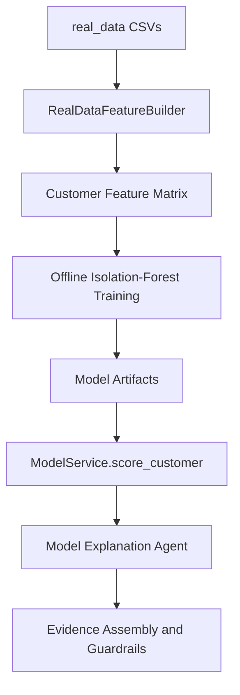

# Real Data and Modeling

## Data Location

The uploaded real dataset is under:

```text
real_data/
```

Files currently detected:

| File | Purpose |
| --- | --- |
| `abm.csv` | ABM transactions with cash/location fields |
| `card.csv` | Card transactions with merchant/ecommerce/location fields |
| `cheque.csv` | Cheque transactions |
| `eft.csv` | EFT transactions |
| `emt.csv` | EMT transactions |
| `westernunion.csv` | Western Union transactions |
| `wire.csv` | Wire transactions |
| `kyc_individual.csv` | Individual customer KYC |
| `kyc_smallbusiness.csv` | Small business customer KYC |
| `kyc_industry_codes.csv` | Industry code lookup |
| `kyc_occupation_codes.csv` | Occupation code lookup |
| `labels.csv` | Sparse evaluation labels |

Observed scale:
- About 5.96M transaction rows.
- 61,410 modeled customers after feature generation.
- 1,000 labeled customers.
- 10 positive labels.

## Current Model Architecture

The system owns a local anomaly scoring pipeline. It no longer requires precomputed `model_outputs.csv` for agent execution.

The offline training command builds the base Isolation-Forest-style artifact in `app.ml.train_model` without external ML runtime dependencies. Runtime scoring then exposes a four-model Data Scientist workbench through `ModelService.score_all_models`:

- Isolation Forest: local random isolation trees over standardized customer features.
- Autoencoder: PyTorch reconstruction-error scorer.
- Variational Autoencoder: PyTorch reconstruction plus KL-divergence scorer, using latent means for deterministic scoring.
- Conditional Variational Autoencoder: PyTorch conditional VAE using customer-type conditions.

All model scores are normalized to `[0, 1]` and are used for investigation prioritization only.

Artifacts are generated offline and ignored by git:

```text
artifacts/models/
  aml_isolation_forest.joblib
  feature_scaler.joblib
  feature_schema.json
  training_metrics.json
  customer_features.csv
  autoencoder_torch.pt
  variational_autoencoder_torch.pt
  conditional_variational_autoencoder_torch.pt
```

The `.joblib` names are retained from the original plan, but the current Isolation Forest and scaler artifact contents are JSON for portability across CLI and API processes. The PyTorch deep-model artifacts are generated deterministically on first scoring use if they are missing.

## Training Command

From `aml_agentic_workbench/backend`:

```bash
python -m app.ml.train_model --data-dir real_data --artifact-dir ../../artifacts/models
```

The command resolves `real_data` at the repository root when run from the backend directory.

Latest verified local training metrics:

```json
{
  "customer_count": 61410,
  "feature_count": 34,
  "label_count": 1000,
  "positive_label_count": 10,
  "alert_threshold": 0.033784,
  "mean_anomaly_score": 0.0583254774070602
}
```

## Feature Families

The current feature builder creates customer-level numeric features from transactions and KYC:

- Total transaction count and amount.
- Mean, max, and standard deviation of amount.
- Debit and credit amount totals.
- Debit/credit amount ratio.
- High-value transaction count.
- Cash transaction ratio.
- Cross-border transaction ratio.
- Active transaction date span.
- Days since last transaction.
- Channel diversity.
- Channel counts and ratios for ABM, card, cheque, EFT, EMT, Western Union, and wire.
- KYC customer type flags.
- Individual income.
- Small-business sales and employee count.
- Onboarding age in days.

## Label Usage

`labels.csv` is used for evaluation and threshold calibration only. It is not used as a supervised training target.

Reason: the positive class is too sparse for reliable supervised modeling in this v1 slice. Using labels for calibration preserves their value without overfitting the detector.

## Scoring Flow



`ModelService.score_customer(customer_id)` returns a single-customer Isolation Forest style envelope:

- `model_version`
- `risk_score`
- `anomaly_score`
- `alert_recommendation`
- `top_features`
- `model_specific_driver_details`
- `explanation_metadata`

`ModelService.score_all_models(top_k=10)` returns top ranked candidates for:

- `isolation_forest`
- `autoencoder`
- `variational_autoencoder`
- `conditional_variational_autoencoder`

If artifacts are missing or a customer does not exist in the feature matrix, agents receive an explicit no-artifact/no-row envelope rather than assumed scores.

## Explanation Methods

Isolation Forest candidates use model-agnostic SHAP over the actual normalized anomaly-score function. SHAP values select customer-specific top drivers, and the feature dictionary supplies display names, definitions, engineering formulas, investigator interpretation, and suggested evidence to review.

Autoencoder, VAE, and CVAE candidates expose per-feature reconstruction contribution. VAE and CVAE scores include a KL term, but the displayed feature attribution is reconstruction-based because the KL term is latent-level rather than directly feature-attributed.

Candidate explanation text can be generated by the configured LLM, but rank, score, threshold, recommendation, and drivers come from deterministic model outputs. Unsafe LLM explanations are replaced with deterministic fallback wording.

## Limitations

- The current scorers are unsupervised and should be treated as prioritization, not proof.
- The local Isolation-Forest-style implementation and prototype PyTorch deep models are not replacements for fully validated bank models.
- Feature engineering is customer-level and does not yet include advanced graph features, peer grouping, sequence models, or typology-specific detectors.
- Labels are sparse and suitable only for sanity checks and coarse calibration.
- Deep-model artifacts train on first use in local development. Production deployment should replace this with governed offline training and artifact promotion.
- Artifacts are local files in v1, not a governed model registry.
