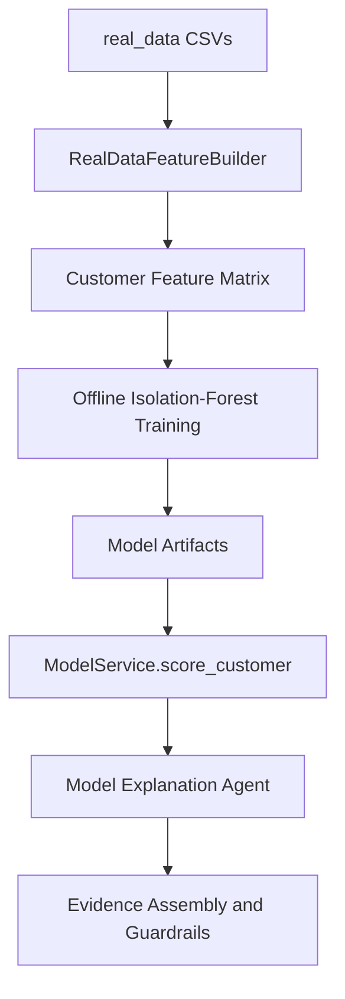

# Real Data and Modeling

## Data Location

The uploaded real dataset is under:

```text
real_data/
```

Files currently detected:

| File | Purpose |
| --- | --- |
| `abm.csv` | ABM transactions with cash/location fields |
| `card.csv` | Card transactions with merchant/ecommerce/location fields |
| `cheque.csv` | Cheque transactions |
| `eft.csv` | EFT transactions |
| `emt.csv` | EMT transactions |
| `westernunion.csv` | Western Union transactions |
| `wire.csv` | Wire transactions |
| `kyc_individual.csv` | Individual customer KYC |
| `kyc_smallbusiness.csv` | Small business customer KYC |
| `kyc_industry_codes.csv` | Industry code lookup |
| `kyc_occupation_codes.csv` | Occupation code lookup |
| `labels.csv` | Sparse evaluation labels |

Observed scale:
- About 5.96M transaction rows.
- 61,410 modeled customers after feature generation.
- 1,000 labeled customers.
- 10 positive labels.

## Current Model Architecture

The system now owns a local anomaly scoring pipeline. It no longer requires precomputed `model_outputs.csv` for agent execution.

The v1 model is an Isolation-Forest-style anomaly scorer implemented in `app.ml.train_model` without external ML runtime dependencies. It uses random isolation trees over standardized customer features and produces bounded anomaly/risk scores.

Artifacts are generated offline and ignored by git:

```text
artifacts/models/
  aml_isolation_forest.joblib
  feature_scaler.joblib
  feature_schema.json
  training_metrics.json
  customer_features.csv
```

The `.joblib` names are retained from the plan, but the current artifact contents are JSON for portability across CLI and API processes.

## Training Command

From `aml_agentic_workbench/backend`:

```bash
python -m app.ml.train_model --data-dir real_data --artifact-dir ../../artifacts/models
```

The command resolves `real_data` at the repository root when run from the backend directory.

Latest verified local training metrics:

```json
{
  "customer_count": 61410,
  "feature_count": 34,
  "label_count": 1000,
  "positive_label_count": 10,
  "alert_threshold": 0.033784,
  "mean_anomaly_score": 0.0583254774070602
}
```

## Feature Families

The current feature builder creates customer-level numeric features from transactions and KYC:

- Total transaction count and amount.
- Mean, max, and standard deviation of amount.
- Debit and credit amount totals.
- Debit/credit amount ratio.
- High-value transaction count.
- Cash transaction ratio.
- Cross-border transaction ratio.
- Active transaction date span.
- Days since last transaction.
- Channel diversity.
- Channel counts and ratios for ABM, card, cheque, EFT, EMT, Western Union, and wire.
- KYC customer type flags.
- Individual income.
- Small-business sales and employee count.
- Onboarding age in days.

## Label Usage

`labels.csv` is used for evaluation and threshold calibration only. It is not used as a supervised training target.

Reason: the positive class is too sparse for reliable supervised modeling in this v1 slice. Using labels for calibration preserves their value without overfitting the detector.

## Scoring Flow



`ModelService.score_customer(customer_id)` returns:

- `model_version`
- `risk_score`
- `anomaly_score`
- `alert_recommendation`
- `top_features`
- `explanation_metadata`

If artifacts are missing or a customer does not exist in the feature matrix, agents receive an explicit no-artifact/no-row envelope rather than assumed scores.

## Limitations

- The current scorer is unsupervised and should be treated as prioritization, not proof.
- The local Isolation-Forest-style implementation is intentionally dependency-light; it is not a replacement for a fully validated bank model.
- Feature engineering is customer-level and does not yet include advanced graph features, peer grouping, sequence models, or typology-specific detectors.
- Labels are sparse and suitable only for sanity checks and coarse calibration.
- Artifacts are local files in v1, not a governed model registry.
